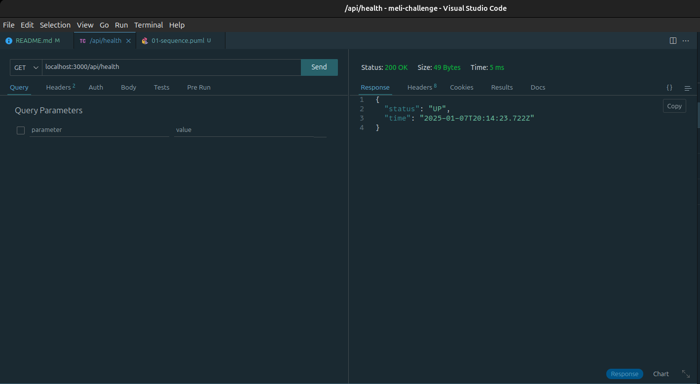
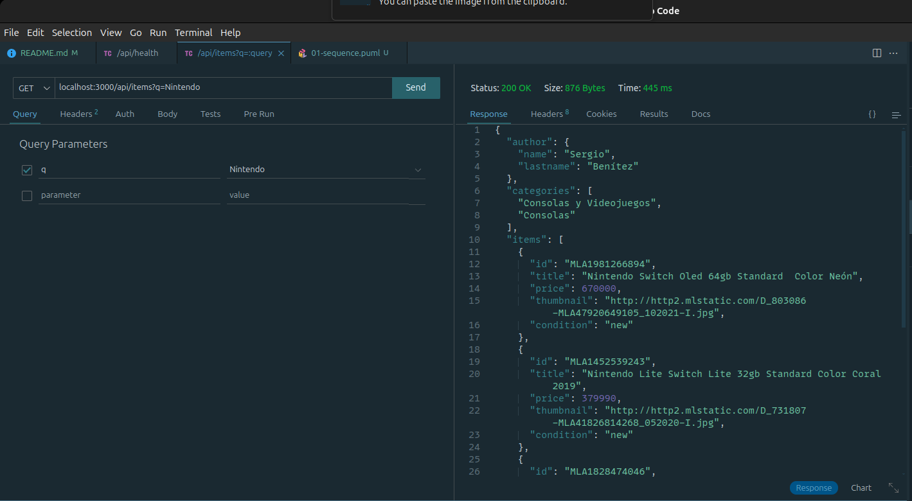
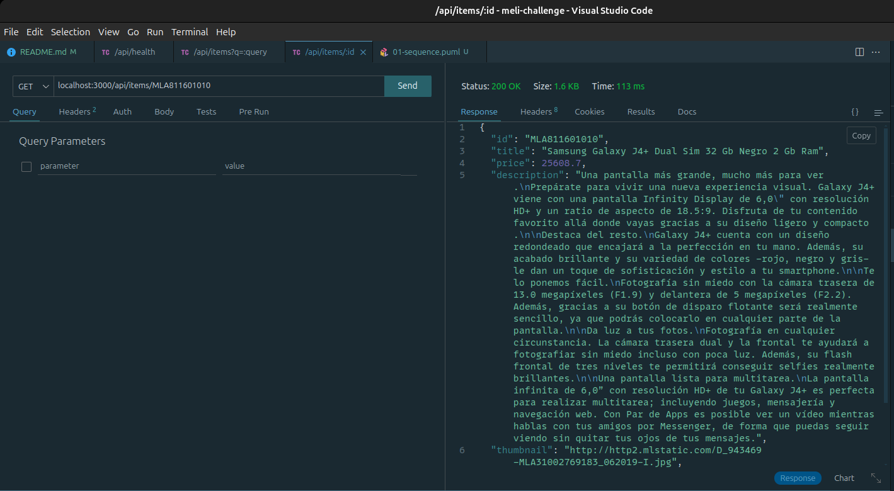
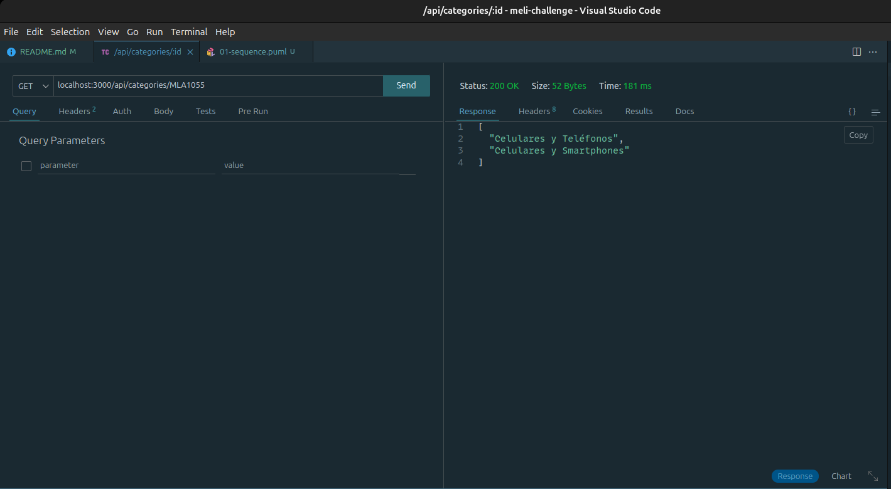

# 👨🏿‍🍳 Backend

Proyecto backend que consulta información de los endpoints de Mercado Libre y aplica una transformación sobre estos datos para exponerla al frontend.

## 🧰 Tech Stack

- [node](https://nodejs.org/en), para correr JavaScript en el servidor.
- [express](https://expressjs.com/es/), como infraestructura web para Node.
- [tsx](https://tsx.is/), como runtime que habilita TypeScript en Node.
- [ts-node](https://www.npmjs.com/package/ts-node), como runtime que habilita TypeScript en Node similar a tsx. Es requerido para utilizar JEst.
- [jest](https://jestjs.io/), como framework de pruebas para Javascript.
- [zod](https://zod.dev/), como validador de esquemas para TypeScript.

## 🔌 PlugIns

- [tsconfig-paths](https://www.npmjs.com/package/tsconfig-paths), para resolver las importaciones type alias en TypeScript

## 📁 Estructura del proyecto

- _routes_: carpeta en donde se específican las rutas que vamos a exponer con express.
- _controllers_: carpeta con las implementaciones de las interfaces de los puntos de entrada.
- _services_: carpeta con los puntos de entrada del paquete (e.g., los endpoints de Mercado Libre)
- _models_: carpeta en donde se definen las entidades.
- _utils_: carpeta con utilidaes transversales para el proyecto.

La relación entre las carpetas es una secuencia como ilustra el siguiente diagrama:

 <!---->

## 🔀 Endpoints

A continuación se listan los endpoints expuestos por este paquete, acompañados con capturas de pantallas [Thunder Client](https://www.thunderclient.com/).

Health

- `GET api/health`, para hacer un ping de salud sobre el estado del servidor.

Items

- `GET api/items?q=:query` retorna una lista de items de acuerdo al parámetro de búsqueda definido en la URL.

- `GET api/items/:id` retorna un item definido por el servicio `item.service`.

Categories

- `GET api/categories/:id` retorna las categorias dado un identificador de categoria.

## 🧞 Comandos

Estos comandos se ejecutan en el directorio raíz del paquete `backend/`.

| Command        | Action                                                                                      |
| :------------- | :------------------------------------------------------------------------------------------ |
| `pnpm install` | Instalar las dependencias                                                                   |
| `pnpm dev`     | Comienza el programa para habilitar los endpoints                                           |
| `pnpm build`   | Corre el compilador de TypeScript para generar los archivos JavaScrip en la carpeta `dist/` |
| `pnpm test`    | Corre las pruebas unitarias del proyecto backend.                                           |

## 🆙 Mejoras

- [ ] Introducir un ecosistema como [effect](https://effect.website/) para potencializar el uso de TypeScript.
- [ ] Incluir una base de datos para el manejo del caché de consultas frecuentes y reducir el número de peticiones.
